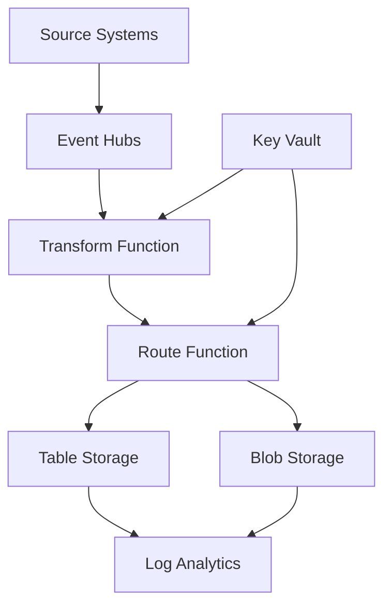

# Call Center Platform Architecture

## Overview
The Call Center Platform is a serverless data processing pipeline that ingests, transforms, and stores call records from multiple UCaaS and PBX systems. The architecture leverages Azure serverless services for scalability and cost-effectiveness.

## Architecture Components

### Ingestion Layer
- **MS Teams Call Records**: Ingested via Graph API webhooks to HTTP-triggered Azure Functions
- **UCaaS / PBX Logs**: Ingested via REST APIs or SBC events to dedicated Event Hubs
- **Event Hub Namespace**: Central message hub with dedicated Event Hubs per source system
  - Enables decoupling of ingestion from processing
  - Supports multiple consumer groups for different processing needs

### Processing Layer
- **Consumer Groups**: Per-subscription consumer groups allow parallel processing
- **Azure Functions**: Serverless functions for transform and route operations
  - **Transform Function**: Normalizes data from different sources to unified schema
  - **Route Function**: Stores processed data to Azure Storage
- **Diagnostic Logging**: Comprehensive logging to Application Insights and Log Analytics

### Storage & Analytics Layer
- **Azure Table Storage**: Indexed call records for fast querying
  - Partitioned by source system
  - Optimized for time-series queries
  - Cost-effective storage for structured data
- **Azure Blob Storage**: Raw payload storage for compliance and auditing
  - Hierarchical naming convention: `{source}/{year}/{month}/{day}/{call_id}_{timestamp}.json`
  - Immutable storage for regulatory compliance
- **Azure Monitor & Log Analytics**: Centralized monitoring and alerting
- **Application Insights**: Performance metrics and tracing

### Governance & Access Layer
- **RBAC Policies**: Role-based access control for all resources
- **Key Vault**: Secure storage of secrets, tokens, and API keys
- **Compliance Hooks**: Built-in support for HIPAA, PCI-DSS, and other compliance requirements

## Data Flow

## Security Considerations

- All data in transit is encrypted using TLS 1.2+
- Data at rest is encrypted using Azure Storage encryption
- Network isolation through Virtual Networks and Service Endpoints
- Authentication via Managed Identities and RBAC
- Audit logging for all access and operations

## Scalability & Performance

- Event-driven architecture scales automatically with load
- Azure Functions scale out based on message volume
- Storage partitioning ensures efficient querying
- Geo-redundancy for high availability

## Monitoring & Observability

- Application Insights for application telemetry
- Azure Monitor for infrastructure metrics
- Custom dashboards for operational visibility
- Alerting based on key performance indicators
- Integration with existing SIEM solutions
